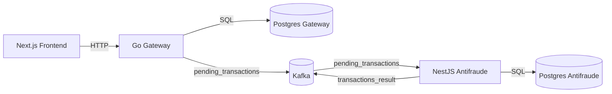

# Arquitetura

[**PT-BR**](./ARCHITECTURE.md) | [EN](./en/ARCHITECTURE.md)

## Diagrama (Mermaid)



## Visão Geral

O sistema é dividido em três serviços principais e dois bancos de dados separados:

- `next-frontend` (UI e fluxo do usuário)
- `go-gateway` (API de contas e transferências)
- `nestjs-anti-fraud` (análise antifraude)
- Postgres do gateway (contas, transferências e eventos processados)
- Postgres do antifraude (contas, transferências processadas e histórico)

Fluxo macro (síncrono + assíncrono):

```
[Next.js] -> [Go Gateway] -> [Postgres gateway]
                      |
                      | publish pending_transactions
                      v
                 [Kafka]
                      ^
                      | publish transactions_result
             [NestJS Antifraude] -> [Postgres antifraude]
```

## Responsabilidades por serviço

### Frontend (Next.js)

- Onboarding: criar conta e modo demo
- Autenticação baseada em API key via cookie
- Fluxo de transferências: listagem, detalhes e criação
- Server Actions para chamadas ao Gateway

### Gateway (Go)

- CRUD mínimo de contas e transferências
- Regra de status:
  - valores > 10000 ficam `pending` e vão para antifraude
  - valores menores têm aprovação/rejeição imediata
- Publica eventos de transações pendentes no Kafka
- Consome resultados do antifraude e atualiza transferências
- Rate limit por API key
- Hash de API key (HMAC) no armazenamento

### Antifraude (NestJS)

- HTTP app expõe API/metrics (porta 3001)
- Worker Kafka consome eventos de transações pendentes e expõe metrics (porta 3101)
- Aplica regras de fraude (specifications)
- Persiste resultado em banco próprio
- Publica o resultado no Kafka

## Confiabilidade e Resiliência

- Gateway salva eventos pendentes via outbox (`outbox_events`) e publica assíncrono.
- Gateway faz deduplicação por `event_id` (tabela `processed_events`) antes de aplicar resultado.
- Antifraude usa inbox (`processed_events`) para dedup de mensagens consumidas do Kafka.
- Consumer do Gateway faz retry com backoff e envia para DLQ após N tentativas.
- DLQ topic: `transactions_result_dlq` com replay auditado (`dlq_replay_audits`).
- Eventos de auditoria em `invoice_events` para timeline no frontend.
- Logs estruturados no gateway com `request_id` e propagação no Kafka (`x-request-id`).
- Health endpoints para readiness e liveness.

## Ownership de dados

- Gateway é a fonte de verdade para contas e transferências exibidas na UI.
- Antifraude mantém seu próprio histórico (não replica dados do gateway).
- A integração entre serviços acontece apenas via Kafka.
