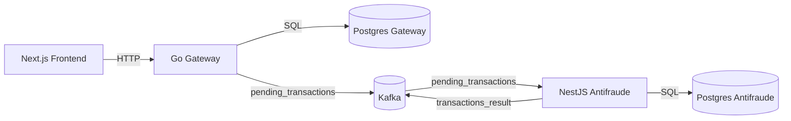

# Architecture

[PT-BR](../ARCHITECTURE.md) | **EN**

## Diagram (Mermaid)



## Overview

The system is split into three core services and two isolated databases:

- `next-frontend` (UI and user flow)
- `go-gateway` (accounts and transfers API)
- `nestjs-anti-fraud` (anti-fraud analysis)
- Gateway Postgres (accounts, transfers, processed events)
- Anti-fraud Postgres (accounts, processed transfers, history)

Macro flow (synchronous + asynchronous):

```
[Next.js] -> [Go Gateway] -> [Postgres gateway]
                      |
                      | publish pending_transactions
                      v
                 [Kafka]
                      ^
                      | publish transactions_result
             [NestJS Anti-fraud] -> [Postgres anti-fraud]
```

## Service Responsibilities

### Frontend (Next.js)

- Onboarding: create account and demo mode
- API key authentication via cookie
- Transfers flow: list, details, and create
- Server Actions for Gateway calls

### Gateway (Go)

- Minimal CRUD for accounts and transfers
- Status rules:
  - values > 10000 go to `pending` and are sent to anti-fraud
  - lower values get immediate approve/reject
- Publishes pending transaction events to Kafka
- Consumes anti-fraud results and updates transfers
- API key rate limiting
- HMAC API key hashing at storage time

### Anti-fraud (NestJS)

- HTTP app exposes API/metrics (port 3001)
- Kafka worker consumes pending transaction events and exposes metrics (port 3101)
- Applies fraud rules (specifications)
- Persists results in its own database
- Publishes results to Kafka

## Reliability and Resilience

- Gateway stores pending events in outbox (`outbox_events`) and publishes asynchronously.
- Gateway deduplicates by `event_id` (`processed_events`) before applying results.
- Anti-fraud uses inbox (`processed_events`) for consumed-message dedup.
- Gateway consumer retries with backoff and sends to DLQ after N attempts.
- DLQ topic: `transactions_result_dlq` with audited replay (`dlq_replay_audits`).
- Audit events in `invoice_events` feed the frontend timeline.
- Gateway uses structured logs with `request_id` propagation in Kafka (`x-request-id`).
- Health endpoints support readiness/liveness checks.

## Data Ownership

- Gateway is the source of truth for accounts and transfers shown in UI.
- Anti-fraud keeps its own history (no full Gateway replication).
- Service integration happens only through Kafka.
